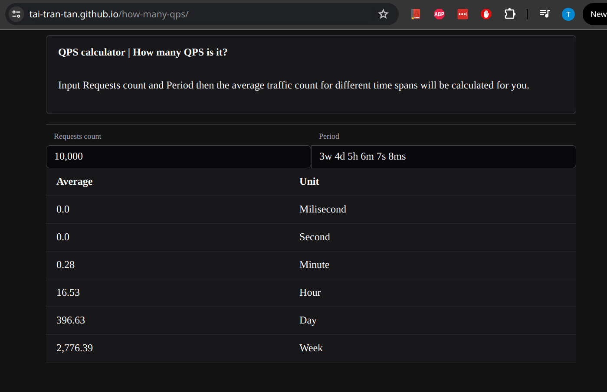

# QPS calculator



## Setup

Make sure to install the dependencies:

```bash
# npm
npm install
```

## Development Server

Start the development server on `http://localhost:3000`:

```bash
# npm
npm run dev
```

## Production

Build the application for production:

```bash
# npm
NUXT_APP_BASE_URL=/how-many-qps/ npx nuxt build --preset github_pages
```

Locally preview production build:

```bash
# npm
npm run preview
```

Deploy to github-page

```bash
npx gh-pages --dotfiles -d .output/public
```

Check out the [deployment documentation](https://nuxt.com/docs/getting-started/deployment) for more information.
